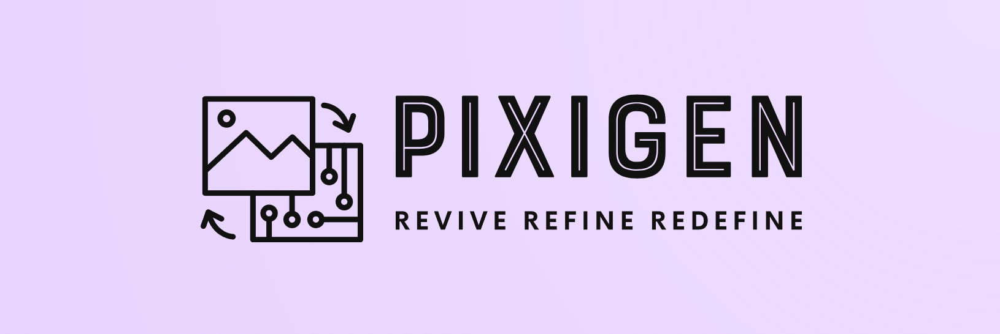
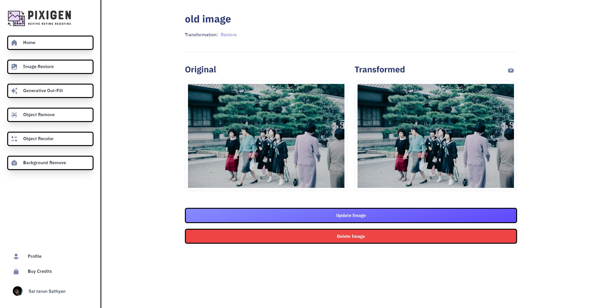
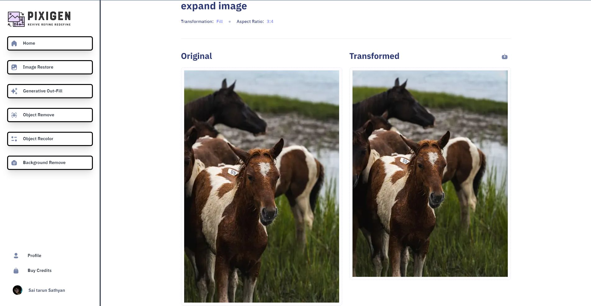
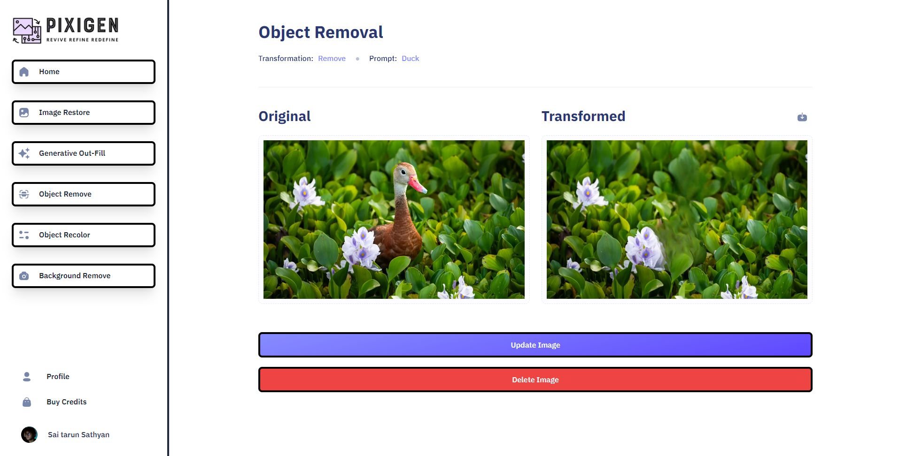
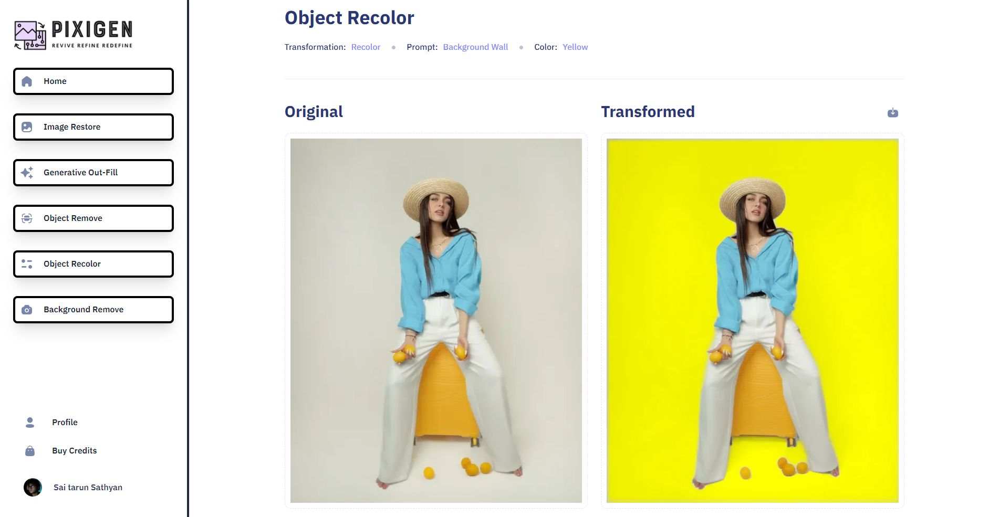
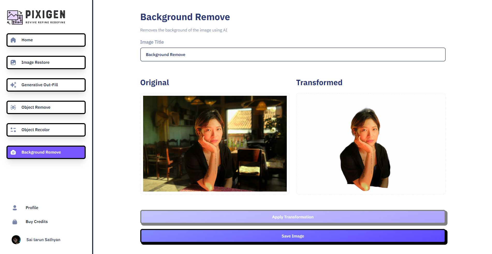

<h1 align="center">

</h1> 

# Pixigen: AI-Powered Image Manipulation Platform

<div align="center">
  <p align="justify">
Pixigen is a SaaS platform designed for advanced image editing using generative AI. The platform offers a range of tools, including image restoration, generative outfill, object removal, object recoloring, and background removal. Built using the MERN stack, Pixigen provides a seamless and user-friendly experience with secure authentication and payment integration.
  </p>
</div>

**Try Pixigen live:** [https://pixigen-dusky.vercel.app/](https://pixigen-dusky.vercel.app/)

---

# 🔑 Features


## Image Restoration
Repair and enhance old or damaged photos.




## Generative Outfill
Extend images by filling missing or undefined areas.




## Object Removal
Effortlessly remove unwanted objects from images.




## Object Recoloring
Change the color of objects while preserving their natural look.




## Background Removal
Remove or replace backgrounds with precision.



---

## 🛠 Tech Stack

- **Frontend**: React, Tailwind CSS
- **Backend**: Node.js, Express.js
- **Database**: MongoDB
- **Cloud Services**: Cloudinary (image storage), Stripe (payment integration)
- **Authentication**: Clerk

---

## 📃 Getting Started

Follow these steps to set up the project locally:

### Prerequisites

Ensure you have the following installed:
- Node.js (>=14.x)
- MongoDB
- npm or yarn
- A Cloudinary account (for image handling)
- A Stripe account (for payment processing)
- A Clerk account (for authentication)

### Installation

1. **Clone the repository:**
   ```bash
   git clone https://github.com/your-username/pixigen.git
   cd pixigen
